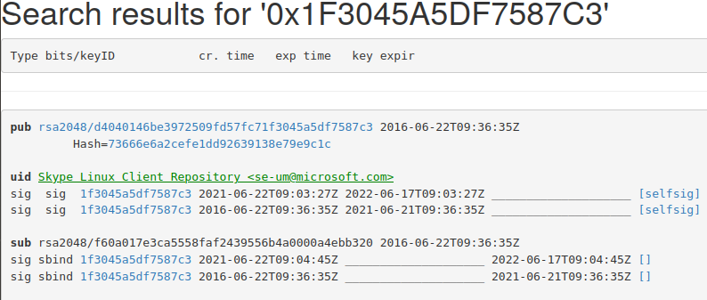

# Solving PPA apt-get update errors

### Useful links

[Ubuntu key server](http://keyserver.ubuntu.com/)

[Beginner’s Guide to Handle Various Update Related Errors in Ubuntu](https://itsfoss.com/ubuntu-update-error/)

## Apt update Errors

#### How to delete a PPA ?

[How to delete a PPA in Ubuntu](https://itsfoss.com/how-to-remove-or-delete-ppas-quick-tip/)

##### Method 1: in command line

`sudo add-apt-repository -r 'https://adoptopenjdk.jfrog.io/adoptopenjdk/deb <codename>`` InRelease'`: removes the provided PPA. If this doesn't work, try method 2.

##### Method 2: using GUI

Use Software & Update utility > Other Software and uncheck the PPA to remove.

### Method 3: direct delete of the PPA .list file

[All explained on StackOverflow](https://askubuntu.com/questions/307/how-can-ppas-be-removed)

`ls -alt /etc/apt/sources.list.d`: List all PPA .list file and other config files.

The `cat` the content of the file so as to make sure this is what you want to delete.

```shell
(base)  ❮ onyr ★  kenzae❯ ❮ apt❯❯ cat /etc/apt/sources.list.d/adoptopenjdk.list 
deb [signed-by=/usr/share/keyrings/adoptopenjdk-archive-keyring.gpg] https://adoptopenjdk.jfrog.io/adoptopenjdk/deb <codename> main
```

Then do it. Delete the file:

```shell
(base)  ❮ onyr ★  kenzae❯ ❮ apt❯❯ sudo rm -i /etc/apt/sources.list.d/adoptopenjdk.list
rm: remove regular file '/etc/apt/sources.list.d/adoptopenjdk.list'? y
```

Don't forget to delete the associated `apt-key` PPA key after that.

```shell
# list the trusted keys
sudo apt-key list
# remove the key
sudo apt-key del KEY_ID
```

#### The following signatures were invalid:

[Problem with MySQL PPA - Key expired](https://askubuntu.com/questions/1120363/mysql-ppa-invalid-signature)

##### method 1 (not working ?)

[StackOverflow on the matter](https://askubuntu.com/questions/1120363/mysql-ppa-invalid-signature)

The errors I got:

```shell
Err:12 https://repo.skype.com/deb stable InRelease                                   
  The following signatures were invalid: EXPKEYSIG 1F3045A5DF7587C3 Skype Linux Client Repository <se-um@microsoft.com>

Err:4 http://repo.mysql.com/apt/ubuntu bionic InRelease                                  
  The following signatures were invalid: EXPKEYSIG 8C718D3B5072E1F5 MySQL Release Engineering <mysql-build@oss.oracle.com>

```

This is because my pub keys are expired. So I need to get the newer pub key for the repositories.

`sudo apt-key list`: This command list all keys I have on my system.

`sudo apt-key list | grep expired`: List all expired public keys I should manually update.

```shell
(base)  ❮ onyr ★  kenzae❯ ❮ apt❯❯ sudo apt-key list | grep expired
Warning: apt-key output should not be parsed (stdout is not a terminal)
pub   dsa1024 2003-02-03 [SCA] [expired: 2019-02-17]
uid           [ expired] MySQL Release Engineering <mysql-build@oss.oracle.com>
pub   rsa2048 2016-06-22 [SC] [expired: 2021-06-21]
uid           [ expired] Skype Linux Client Repository <se-um@microsoft.com>

```

On the above, it's easy to see that I have 2 expired keys.

> While trying the general provided solutions everywhere on StackOverflow, I got this:

```shell
(base)  ❮ onyr ★  kenzae❯ ❮ apt❯❯ sudo apt-key adv --keyserver keys.gnupg.net --recv-keys 8C718D3B5072E1F5
Executing: /tmp/apt-key-gpghome.GE1KABpZUy/gpg.1.sh --keyserver keys.gnupg.net --recv-keys 8C718D3B5072E1F5
gpg: keyserver receive failed: No name
```

This is because the server `keys.gnupg.net` no longer exists (more info [here](https://stackoverflow.com/questions/66217436/gpg-keyserver-receive-failed-no-name)), so replace it with a newer one as explained [here | StackOverflow](https://stackoverflow.com/questions/66217436/gpg-keyserver-receive-failed-no-name). I chose to use `keyserver.ubuntu.com` instead.

Now, note the key from the error message, here `1F3045A5DF7587C3` for instance for Microsoft-Skype. Now  write `0x1F3045A5DF7587C3` at `http://keyserver.ubuntu.com` and read carefully the result.



As one can see, we can read `key expir` at the top row. This is obviously since the key we searched is expired. What is interesting is the `sig` stuff. The number repeated everywhere is the new public key we are looking for.

Now it's time to get the newer key.

`gpg --keyserver keyserver.ubuntu.com --recv-key 1f3045a5df7587c3`: Get the newer key, here for `1f3045a5df7587c3`.

```shell
(base)  ❮ onyr ★  kenzae❯ ❮ apt❯❯ gpg --keyserver keyserver.ubuntu.com --recv-key 5072E1F5
gpg: key 8C718D3B5072E1F5: 1 duplicate signature removed
gpg: key 8C718D3B5072E1F5: 56 signatures not checked due to missing keys
gpg: key 8C718D3B5072E1F5: public key "MySQL Release Engineering <mysql-build@oss.oracle.com>" imported
gpg: no ultimately trusted keys found
gpg: Total number processed: 1
gpg:               imported: 1
(base)  ❮ onyr ★  kenzae❯ ❮ apt❯❯ gpg --keyserver keyserver.ubuntu.com --recv-key 1f3045a5df7587c3
gpg: key 1F3045A5DF7587C3: public key "Skype Linux Client Repository <se-um@microsoft.com>" imported
gpg: Total number processed: 1
gpg:               imported: 1

```

Normally now the problem should be solved.

```shell
E:Failed to fetch https://adoptopenjdk.jfrog.io/adoptopenjdk/deb/dists/<codename>/InRelease  400  Bad Request [IP: 35.190.146.4 443], E:The repository 'https://adoptopenjdk.jfrog.io/adoptopenjdk/deb <codename> InRelease' is not signed., W:Updating from such a repository can't be done securely, and is therefore disabled by default., W:See apt-secure(8) manpage for repository creation and user configuration details., E:The repository 'https://adoptopenjdk.jfrog.io/adoptopenjdk/deb/dists/ubuntu bionic Release' does not have a Release file., W:Updating from such a repository can't be done securely, and is therefore disabled by default., W:See apt-secure(8) manpage for repository creation and user configuration details., W:GPG error: http://repo.mysql.com/apt/ubuntu bionic InRelease: The following signatures were invalid: EXPKEYSIG 8C718D3B5072E1F5 MySQL Release Engineering <mysql-build@oss.oracle.com>, E:The repository 'http://repo.mysql.com/apt/ubuntu bionic InRelease' is not signed., W:Updating from such a repository can't be done securely, and is therefore disabled by default., W:See apt-secure(8) manpage for repository creation and user configuration details., W:GPG error: https://repo.skype.com/deb stable InRelease: The following signatures were invalid: EXPKEYSIG 1F3045A5DF7587C3 Skype Linux Client Repository <se-um@microsoft.com>, E:The repository 'https://repo.skype.com/deb stable InRelease' is no
```

##### method 2 (working 2)

So apparently, method 1 solved nothing. I still got the error:

```shell
Err:7 http://repo.mysql.com/apt/ubuntu bionic InRelease
  The following signatures were invalid: EXPKEYSIG 8C718D3B5072E1F5 MySQL Release Engineering <mysql-build@oss.oracle.com>
Err:16 https://repo.skype.com/deb stable InRelease
  The following signatures were invalid: EXPKEYSIG 1F3045A5DF7587C3 Skype Linux Client Repository <se-um@microsoft.com>
```

I tried another way. If I list expired keys, I still get the same as before.

```shell
(base)  ❮ onyr ★  kenzae❯ ❮ apt❯❯ sudo apt-key list | grep expired
Warning: apt-key output should not be parsed (stdout is not a terminal)
pub   dsa1024 2003-02-03 [SCA] [expired: 2019-02-17]
uid           [ expired] MySQL Release Engineering <mysql-build@oss.oracle.com>
pub   rsa2048 2016-06-22 [SC] [expired: 2021-06-21]
uid           [ expired] Skype Linux Client Repository <se-um@microsoft.com>

```

So I tried to just delete these keys.

With `sudo apt-key list`, I list the keys and look for `[ expired]` labels like so:

```shell
pub   dsa1024 2003-02-03 [SCA] [expired: 2019-02-17]
      A4A9 4068 76FC BD3C 4567  70C8 8C71 8D3B 5072 E1F5
uid           [ expired] MySQL Release Engineering <mysql-build@oss.oracle.com>

pub   rsa2048 2016-06-22 [SC] [expired: 2021-06-21]
      D404 0146 BE39 7250 9FD5  7FC7 1F30 45A5 DF75 87C3
uid           [ expired] Skype Linux Client Repository <se-um@microsoft.com>
```

The import thing to know is that the identifier of the key are the 8 last digits of the key (more info [here](https://askubuntu.com/questions/107177/how-can-i-remove-gpg-key-that-i-added-using-apt-key-add)). For instance for `A4A9 4068 76FC BD3C 4567  70C8 8C71 8D3B 5072 E1F5`, the identifier would be `5072E1F5`.

`sudo apt-key del DF7587C3`: This command deletes the key with provided identifier.

Then, after a `sudo apt-get update`, I felt back into an error I know I can fix:

```shell
Err:15 https://repo.skype.com/deb stable InRelease                           
  The following signatures couldn't be verified because the public key is not available: NO_PUBKEY 1F3045A5DF7587C3
```

To solve this issue, I just run `sudo apt-key adv --keyserver keyserver.ubuntu.com --recv-keys 1F3045A5DF7587C3` with the key given in the error message. I get:

```shell
(base)  ❮ onyr ★  kenzae❯ ❮ apt❯❯ sudo apt-key adv --keyserver keyserver.ubuntu.com --recv-keys 1F3045A5DF7587C3
Executing: /tmp/apt-key-gpghome.96dHcVZ81G/gpg.1.sh --keyserver keyserver.ubuntu.com --recv-keys 1F3045A5DF7587C3
gpg: key 1F3045A5DF7587C3: public key "Skype Linux Client Repository <se-um@microsoft.com>" imported
gpg: Total number processed: 1
gpg:               imported: 1
```

Problem solved ;).
